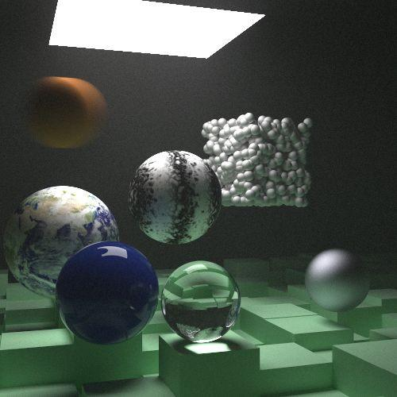
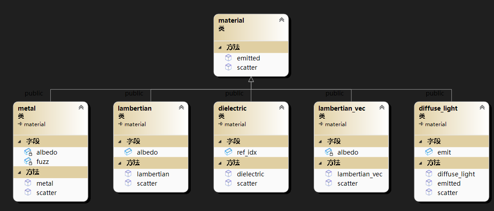
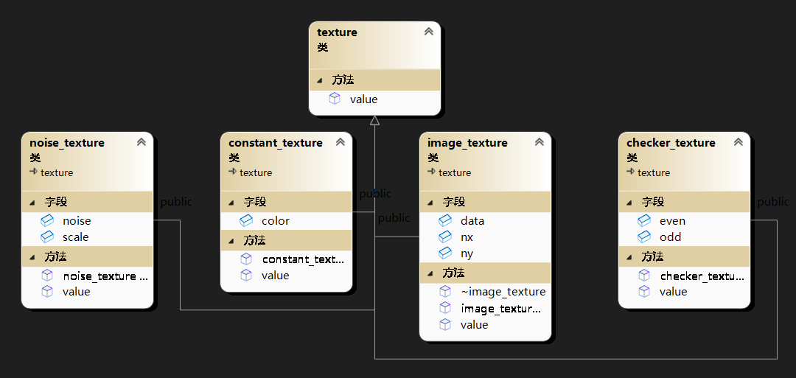
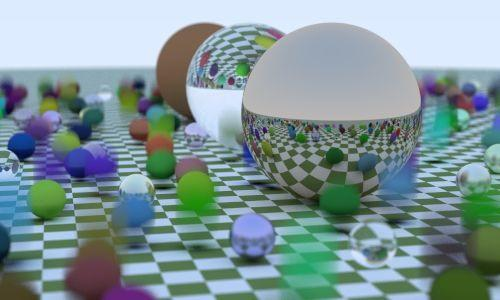
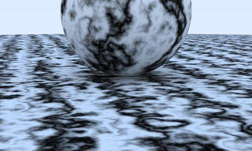
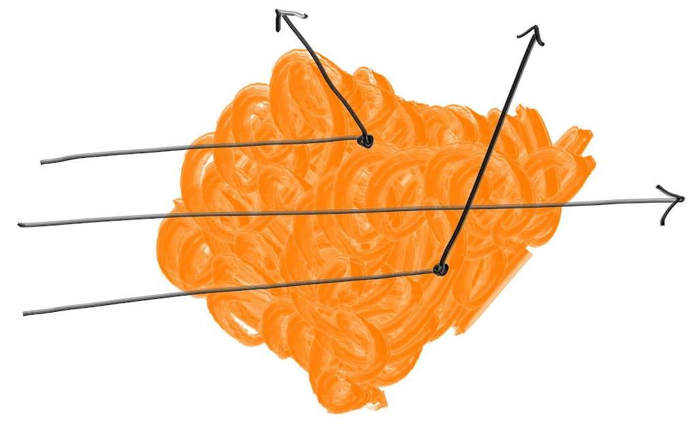
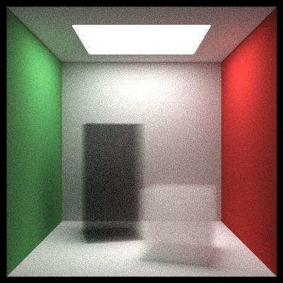

# myRayTracing

# 效果：

　　​​

# 说明

　　光线追踪项目，主要参考为三部曲中的：《Ray Tracing in One Weekend》、《Ray Tracing: The Next Week》

　　核心原理：从像素发射射线，并计算射线得到的颜色。

　　主函数代码：

```c++
// Main code
int main(int, char**)
{
    //初始化相机相关属性
    camera camera(lookfrom, lookat, vup, vfov, aspect_ratio, aperture, dist_to_focus, 0.0, 1.0);
    //加载场景
    auto world =final_scene();
    //逐像素发出射线与场景中物体计算是否相交，返回颜色
    for (int j = image_height - 1; j >= 0; --j) {
        for (int i = 0; i < image_width; ++i) {
            vec3 color(0, 0, 0);
            for (int s = 0; s < samples_per_pixel; ++s) {
                auto u = double(i + random_double()) / image_width;
                auto v = double(j + random_double()) / image_height;
                ray r = camera.get_ray(u, v);
                color += ray_color(r,background, world,max_depth);
            }
            color.write_color(image,j,i,samples_per_pixel); // 将像素值写入到图像中
        }
    }
    // 显示图像
    return 0;
}
```

　　核心函数：通过递归计算颜色

```c++
vec3 ray_color(const ray& r, const vec3& background, const hittableList& world, int depth) {
    hit_record rec;
    if (depth <= 0)
        return vec3(0, 0, 0);
    if (!world.hit(r, 0.001, infinity, rec))
        return background;
    ray scattered;
    vec3 attenuation;
    vec3 emitted = rec.mat_ptr->emitted(rec.u, rec.v, rec.p);
    if (!rec.mat_ptr->scatter(r, rec, attenuation, scattered))
        return emitted;

    return emitted + attenuation * ray_color(scattered, background, world, depth - 1);
}
```

# 实现可相交的物体

```c++
/// <summary>
/// 任何可能与光线相交的物体都继承这个基类
/// 加入一个区间tmin,tmax来判断相交是否有效
/// 计算的结果：点，法线，t都存在一个结构体内
/// </summary>
class hittable {
public:
    virtual bool hit(const ray& r, double t_min, double t_max, hit_record& rec) const = 0;
    virtual bool bounding_box(double t0, double t1, aabb& output_box) const = 0;
};
```

　　所有物体包括bvh都继承hittable

　　场景中的物体统一放在hittableList中

```c++
class hittableList :public hittable {
public:
    hittableList() {}
    hittableList(shared_ptr<hittable> object) { add(object); }

    void clear() { objects.clear(); }
    void add(shared_ptr<hittable> object) { objects.push_back(object); }

    virtual bool hit(const ray& r, double tmin, double tmax, hit_record& rec) const;
    virtual bool bounding_box(double t0, double t1, aabb& output_box) const;
    auto getObjects() {
        return this->objects;
    }

    std::vector<shared_ptr<hittable>> objects;
};
```

# 实现层次包围盒

　　先定义如何产生包围盒，使用轴对齐包围盒

```c++
class aabb {
public:
    aabb() {}
    aabb(const vec3& a, const vec3& b) { _min = a; _max = b; }

    vec3 min() const { return _min; }
    vec3 max() const { return _max; }

    bool hit(const ray& r, double tmin, double tmax) const;
    vec3 _min;
    vec3 _max;
};

inline bool aabb::hit(const ray& r, double tmin, double tmax) const {
    for (int a = 0; a < 3; a++) {
        auto invD = 1.0f / r.direction()[a];
        auto t0 = (min()[a] - r.origin()[a]) * invD;
        auto t1 = (max()[a] - r.origin()[a]) * invD;
        if (invD < 0.0f)
            std::swap(t0, t1);
        tmin = t0 > tmin ? t0 : tmin;
        tmax = t1 < tmax ? t1 : tmax;
        if (tmax <= tmin)
            return false;
    }
    return true;
}
```

　　然后各个物体可以实现自己的包围盒

　　如何使用包围盒？

　　定义BVH节点类, 采用最简单直接的分割原则:

1. 随机选取一个轴来分割
2. 使用库函数`sort()`​对图元进行排序
3. 对半分, 每个子树分一半的物体

　　然后将场景中物体列表转为bvh_node即可

```c++

class bvh_node : public hittable {
public:
    bvh_node();

    bvh_node(hittableList& list, double time0, double time1)
        : bvh_node(list.objects, 0, list.objects.size(), time0, time1)
    {}

    bvh_node(
        std::vector<std::shared_ptr<hittable>>& objects,
        size_t start, size_t end, double time0, double time1);

    virtual bool hit(const ray& r, double tmin, double tmax, hit_record& rec) const;
    virtual bool bounding_box(double t0, double t1, aabb& output_box) const;

public:
    shared_ptr<hittable> left;
    shared_ptr<hittable> right;
    aabb box;
};

inline bool box_compare(const shared_ptr<hittable> a, const shared_ptr<hittable> b, int axis) {
    aabb box_a;
    aabb box_b;

    if (!a->bounding_box(0, 0, box_a) || !b->bounding_box(0, 0, box_b))
        std::cerr << "No bounding box in bvh_node constructor.\n";

    return box_a.min().e[axis] < box_b.min().e[axis];
}


inline bool box_x_compare(const shared_ptr<hittable> a, const shared_ptr<hittable> b) {
    return box_compare(a, b, 0);
}

inline bool box_y_compare(const shared_ptr<hittable> a, const shared_ptr<hittable> b) {
    return box_compare(a, b, 1);
}

inline bool box_z_compare(const shared_ptr<hittable> a, const shared_ptr<hittable> b) {
    return box_compare(a, b, 2);
}

bvh_node::bvh_node(std::vector<std::shared_ptr<hittable>>& objects,size_t start, size_t end, double time0, double time1) {
    //随机选择一个轴作为划分节点的依据
    int axis = random_int(0, 2);
    //根据选择的轴，选择对应的比较函数作为排序的依据
    auto comparator = (axis == 0)? box_x_compare:(axis == 1)?box_y_compare:box_z_compare;
    //计算物体的范围
    size_t object_span = end - start;
    //叶子节点是实际的hittable物体
    //如果只有一个物体 左右节点都指向该物体
    if (object_span == 1) {
        left = right = objects[start];
    }
    //如果有两个物体，根据比较函数的结果，选择将物体分别赋值给左右子节点
    else if (object_span == 2) {
        if (comparator(objects[start], objects[start + 1])) {
            left = objects[start];
            right = objects[start + 1];
        }
        else {
            left = objects[start + 1];
            right = objects[start];
        }
    }
    else { //排序找到中间位置 递归执行
        std::sort(objects.begin() + start, objects.begin() + end, comparator);

        auto mid = start + object_span / 2;
        left = make_shared<bvh_node>(objects, start, mid, time0, time1);
        right = make_shared<bvh_node>(objects, mid, end, time0, time1);
    }

    aabb box_left, box_right;

    if (!left->bounding_box(time0, time1, box_left)||!right->bounding_box(time0, time1, box_right)
        )
        std::cerr << "No bounding box in bvh_node constructor.\n";

    box = surrounding_box(box_left, box_right);
}


bool bvh_node::hit(const ray& r, double t_min, double t_max, hit_record& rec) const {
    if (!box.hit(r, t_min, t_max))
        return false;

    bool hit_left = left->hit(r, t_min, t_max, rec);
    bool hit_right = right->hit(r, t_min, hit_left ? rec.t : t_max, rec);

    return hit_left || hit_right;
}

bool bvh_node::bounding_box(double t0, double t1, aabb& output_box) const {
    output_box = box;
    return true;
}
```

　　使用*static_cast&lt;hittable_list&gt;(make_shared&lt;bvh_node&gt;(world,0,1))转换。*

# 材质

　　基类：

```c++
class material {
public:
    virtual vec3 emitted(double u, double v, const vec3 & p) const {
        return vec3(0, 0, 0);
    }
    virtual bool scatter(
        const ray& r_in, const hit_record& rec, vec3& attenuation, ray& scattered
    ) const = 0;
};
```

　　‍

　　​​

# 纹理

　　首先还是抽象出基类，对于纹理只要能够得到对应颜色就行，所以基类设计为：

```c++
class texture {
public:
    virtual vec3 value(double u, double v, const vec3& p) const = 0;
};

```

　　其他所有的纹理都继承并实现texture类

　　​​

　　checker_texture示例：

　　​​

　　noise_texture是使用柏林噪声通过程序生成纹理：

　　​​

　　image_texture是最常用的读取图片，通过贴图显示纹理

# 体积体

　　将体积体表示为一个随机表面。一团烟雾在其实可以用一个概率上不确定在什么位置的平面来代替。

　　首先让我们来生成一个固定密度的体积体。光线可以在体积体内部发生散射, 也可以像图中的中间那条射线一样直接穿过去。体积体越薄越透明, 直接穿过去的情况就越有可能会发生。光线在体积体中直线传播所经过的距离也决定了光线采用图中哪种方式通过体积体。

　　​​

　　光线与体积体相交

　　当光线射入体积体时, 它可能在任意一点发生散射。体积体越浓, 越可能发生散射。在任意微小的距离差 ****发生散射的概率如下:

　　$\text{probability} = C \cdot \Delta L$

　　其中 **C** 是体积体的光学密度比例常数。 经过了一系列不同的等式运算, 会随机的得到一个光线发生散射的距离值。如果根据这个距离来说, 散射点在体积体外, 那么我们认为没有相交, 不调用`hit`​函数。对于一个静态的体积体来说, 只需要他的密度C和边界，用另一个hittable物体来表示体积体的边界:

```cpp
class constant_medium : public hittable {
    public:
        constant_medium(shared_ptr<hittable> b, double d, shared_ptr<texture> a)
            : boundary(b), neg_inv_density(-1/d)
        {
            phase_function = make_shared<isotropic>(a);
        }

        virtual bool hit(const ray& r, double t_min, double t_max, hit_record& rec) const;

        virtual bool bounding_box(double t0, double t1, aabb& output_box) const {
            return boundary->bounding_box(t0, t1, output_box);
        }

    public:
        shared_ptr<hittable> boundary;
        shared_ptr<material> phase_function;
        double neg_inv_density;
};
```

　　对于散射的方向来说, 采用随机单位向量

```cpp
class isotropic : public material {
    public:
        isotropic(shared_ptr<texture> a) : albedo(a) {}

        virtual bool scatter(
            const ray& r_in, const hit_record& rec, vec3& attenuation, ray& scattered
        ) const  {
            scattered = ray(rec.p, random_in_unit_sphere(), r_in.time());
            attenuation = albedo->value(rec.u, rec.v, rec.p);
            return true;
        }

    public:
        shared_ptr<texture> albedo;
};
```

　　hit函数如下:

```cpp
bool constant_medium::hit(const ray& r, double t_min, double t_max, hit_record& rec) const {

    hit_record rec1, rec2;
    if (!boundary->hit(r, -infinity, infinity, rec1))
        return false;
    if (!boundary->hit(r, rec1.t+0.0001, infinity, rec2))
        return false;
    if (rec1.t < t_min) rec1.t = t_min;
    if (rec2.t > t_max) rec2.t = t_max;
    if (rec1.t >= rec2.t)
        return false;
    if (rec1.t < 0)
        rec1.t = 0;
    const auto ray_length = r.direction().length();
    const auto distance_inside_boundary = (rec2.t - rec1.t) * ray_length;
    const auto hit_distance = neg_inv_density * log(random_double());
    if (hit_distance > distance_inside_boundary)
        return false;
    rec.t = rec1.t + hit_distance / ray_length;
    rec.p = r.at(rec.t);
    rec.normal = vec3(1,0,0);  // arbitrary
    rec.front_face = true;     // also arbitrary
    rec.mat_ptr = phase_function;
    return true;
}
```

　　​​

　　‍
